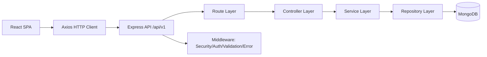

# Technical Requirements Document (TRD)

## 1. Architecture Overview
BookVerse follows a layered architecture:
- Presentation layer (React SPA)
- API layer (Express routes/controllers)
- Business layer (services)
- Data access layer (repositories + Mongoose models)

## 2. Backend Technical Stack
- Node.js (ES modules)
- Express.js
- MongoDB + Mongoose
- JWT (`jsonwebtoken`)
- Password hashing (`bcrypt`)
- Validation (`zod`)
- Security middleware:
  - `helmet`
  - `cors`
  - `express-rate-limit`
  - `cookie-parser`

## 3. Frontend Technical Stack
- React 18
- React Router v6
- Axios
- Formik
- Bootstrap + custom CSS

## 4. Infrastructure and Environment
- Environment variables loaded and validated through `dotenv` + `envalid`.
- Required env keys include:
  - `MONGODB_URI`
  - `ACCESS_TOKEN_SECRET`
  - `REFRESH_TOKEN_SECRET`
  - `CORS_ORIGIN`
  - `COOKIE_NAME`, `COOKIE_DOMAIN`, `COOKIE_SECURE`
  - token expiry settings

## 5. API and Security Technical Requirements
- Base path: `/api/v1`
- JWT access token required for protected endpoints.
- Refresh token stored in HTTP-only cookie.
- Error responses standardized via API response helpers.
- Validation errors produce `422` with details.

## 6. Project Structure and Scalability
- Domain grouping by `auth`, `books`, `reviews`.
- Separation of concerns:
  - route definition
  - controller orchestration
  - service business logic
  - repository data access
- This structure supports future extension (roles, additional modules, microservice split).

## 7. Build, Lint, and Test Requirements
- Root scripts:
  - `npm test` (Vitest)
  - `npm run lint` (ESLint)
  - `npm run build` (env/build validation)
- Client scripts:
  - `npm run build` (Vite build)
- Test files are isolated under `tests/api`.
